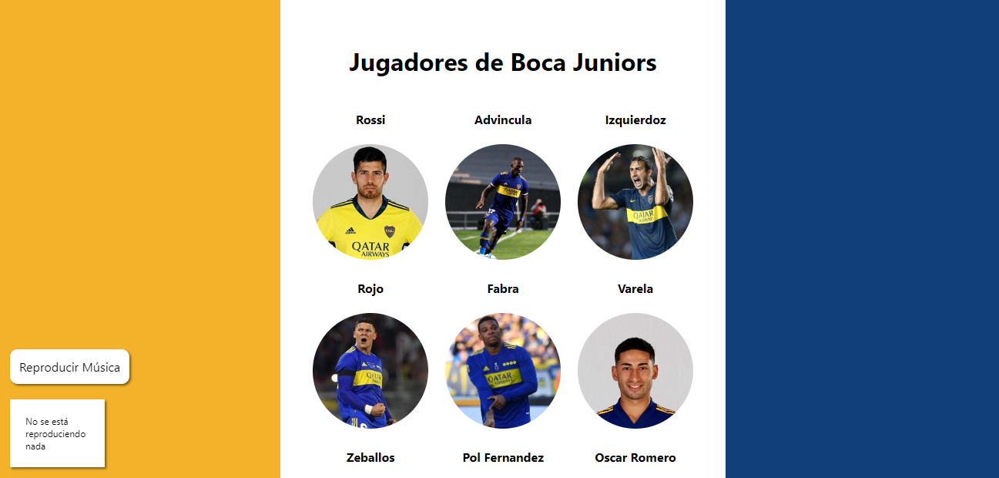

# Jugadores de Boca Juniors

Una página en la que se incluyen 9 jugadores de Boca Juniors con sus respectivas descripciones. Fue hecha como un proyecto escolar en la materia 'Diseño de Páginas Web'.

Tiene como elemento a destacar un reproductor que reproduce una canción en específico y guarda el tiempo de reproducción a lo largo de las demás páginas. 

Está escrito en HTML, CSS y Javascript.

La canción utilizada es: "Boca Juniors - ¿Qué pasó con el fantasma del descenso?" de PinoVersiona.

